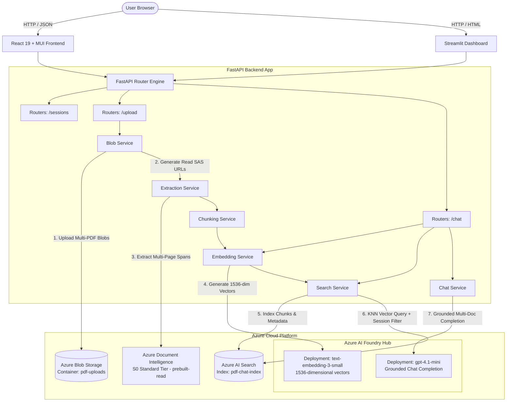
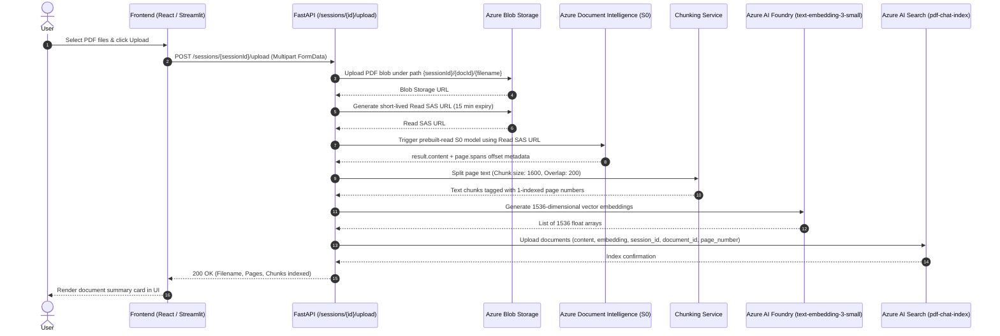
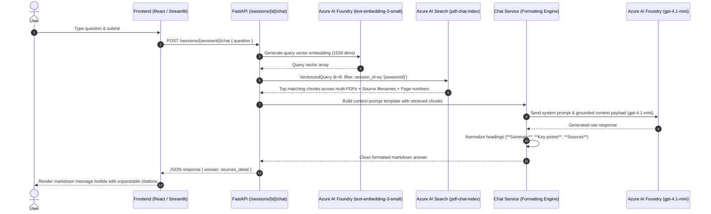

# Azure System Architecture

## Overview

DocSpring RAG Assistant is built on a high-performance, cloud-native RAG architecture built on top of **Microsoft Azure AI Services** and **Azure AI Foundry**. The system decouples frontend clients, RESTful API orchestration, blob storage, OCR extraction, multi-PDF vector search, and LLM inference.

---

## High-Level System Architecture Diagram

---

## Detailed Data Pipelines

### 1. Multi-PDF Upload, Azure OCR & Vector Indexing Pipeline

---

### 2. Conversational RAG Query & Multi-PDF Answer Pipeline

---

## Session Isolation & Security Model

To prevent cross-session document leakage in multi-tenant or multi-session environments:

1. **Azure Blob Storage Pathing**: PDF files are stored using structured blob paths:  
   `{session_id}/{document_id}/{filename}`
2. **Azure AI Search OData Filtering**: Every indexed chunk document contains a `session_id` filterable field. Similarity queries execute with strict OData security filters:  
   `$filter=session_id eq '{session_id}'`
3. **Session Teardown**: When a session is deleted (`DELETE /sessions/{sessionId}`), the backend executes:
   - `delete_session_blobs()`: Deletes all session PDF blobs from Azure Storage.
   - `delete_session_chunks()`: Purges all matching documents from the Azure AI Search index.

---

## Azure Service Component Responsibilities

| Backend File | Azure Integration & Responsibility |
| :--- | :--- |
| `backend/config.py` | Loads credentials for Azure Blob Storage, Document Intelligence (S0), Azure AI Foundry, and Azure AI Search from `.env`. |
| `backend/services/blob_service.py` | Uploads PDF files to Azure Blob Storage and generates read-only SAS URLs for Azure Document Intelligence. |
| `backend/services/extraction_service.py` | Calls Azure Document Intelligence (`prebuilt-read` S0 Tier) via SAS URL to extract full-text layout and page-level character offsets (`spans`). |
| `backend/services/chunking_service.py` | Performs recursive text chunking with configurable overlap (`1600` chars / `200` overlap). |
| `backend/services/embedding_service.py` | Calls Azure AI Foundry embedding deployment (`text-embedding-3-small`, 1536 dimensions). |
| `backend/services/search_service.py` | Manages Azure AI Search index schema (`pdf-chat-index`), HNSW vector profile, document indexing, and session-scoped multi-PDF vector queries. |
| `backend/services/chat_service.py` | Sends grounded context prompts to Azure AI Foundry Chat deployment (`gpt-4.1-mini`) and normalizes answer section formatting. |

---

## Cost & Resource Optimization

1. **Direct SAS URL Extraction**: The PDF file streams directly from Azure Blob Storage to Azure Document Intelligence via SAS URL. The file is never held in backend RAM.
2. **Standard S0 Tier OCR Scaling**: Uses Azure Document Intelligence Standard `S0` Tier for fast multi-page and multi-PDF extraction without page rate-limiting errors.
3. **Azure AI Foundry Management**: Centralized deployment hub for model monitoring, cost control, and managing `gpt-4.1-mini` and `text-embedding-3-small`.
4. **Batch Indexing**: Document chunks and embeddings are uploaded to Azure AI Search in batch sizes of `100` documents to minimize HTTP overhead.
5. **Optimized Embedding Dimensions**: Uses `text-embedding-3-small` (1536 dimensions) for lower vector search index storage footprint while maintaining high retrieval precision.